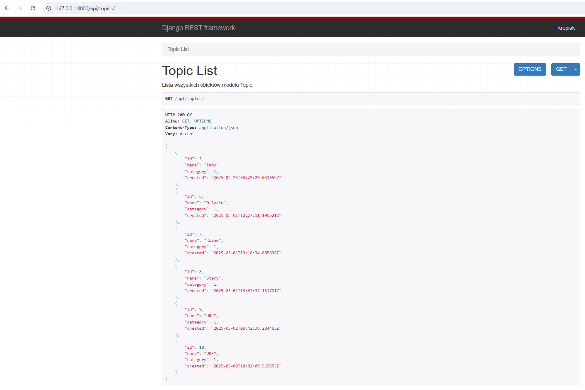

# Aplikacje WWW

## Lab 8 - Budowa pierwszych endpoint'ów REST API oraz podstawowa walidacja wewnątrz serializerów danych.
---

:warning: :warning: :warning:
> GIT: Rozpoczęcie pracy w ramach kolejnego laba powinno odbywać w nowym branchu po zatwierdzeniu zmian w poprzednim i scaleniu zmian do brancha main, jeżeli wszystko działa poprawnie.

W odróżnienu od klasy `HttpRequest` z frameworka Django, DRF wykorzystuje rozszerzającą ją klasę `Request`, która jest lepiej przystosowana do obsługi żądań REST API. Wszelkie wartości takiego żądania znajdują się w zmiennej `request.data` w odróżnieniu od `request.POST` (klasa HttpRequest).
Do obsługi odpowiedzi wykorzystywana jest natomiast klasa `Response`, które w podstawowej formie zawiera wszelkie dane w surowej formie i dopiero w fazie negocjacji z klientem decyduje o ich postaci.

Chcąc stworzyć endpoint REST możemy wykorzystać dwa opakowania (ang. wrappers) z DRF:
* dekorator `@api_view` dla widoków opartych na funkcjach,
* klasę `APIView` dla widoków opartych na klasach.

Poniżej przykład implementacji endpointu opartego na widokach funkcyjnych. Z racji tego, że posiadamy już widoki oparte o szablony, widoki dla API REST zdefiniujemy w oddzielnym pliku. Tworzymy więc w folderze aplikacji (posts) plik `api_views.py` z zawartością z listingu 1.

**_Listing 1_**

Plik: `posts/api_views.py`
```python
from django.shortcuts import render
from rest_framework import status
from rest_framework.decorators import api_view
from rest_framework.response import Response
from .models import Topic, Category, Post
from .serializers import TopicSerializer

# określamy dostępne metody żądania dla tego endpointu
@api_view(['GET'])
def topic_list(request):
    """
    Lista wszystkich obiektów modelu Topic.
    """
    if request.method == 'GET':
        topics = Topic.objects.all()
        # many=True oznacza zwrócenie wielu instancji obiektu, a nie tylko jednego (lista)
        serializer = TopicSerializer(topics, many=True)
        return Response(serializer.data)


@api_view(['GET', 'PUT', 'DELETE'])
def topic_detail(request, pk):

    """
    :param request: obiekt DRF Request
    :param pk: id obiektu Topic
    :return: Response (with status and/or object/s data)
    """
    try:
        topic = Topic.objects.get(pk=pk)
    except Topic.DoesNotExist:
        return Response(status=status.HTTP_404_NOT_FOUND)

    """
    Zwraca pojedynczy obiekt typu Topic.
    """
    if request.method == 'GET':
        topic = Topic.objects.get(pk=pk)
        serializer = TopicSerializer(topic)
        return Response(serializer.data)

    # dodajemy nowy obiekt Topic
    elif request.method == 'PUT':
        serializer = TopicSerializer(topic, data=request.data)
        if serializer.is_valid():
            serializer.save()
            return Response(serializer.data)
        return Response(serializer.errors, status=status.HTTP_400_BAD_REQUEST)

    # usuwanie obiektu Topic
    elif request.method == 'DELETE':
        topic.delete()
        return Response(status=status.HTTP_204_NO_CONTENT)

```

Teraz należy jeszcze w klasie serializera dodać implementację metody `update` (jeżeli jeszcze jej tam nie ma), która jest wywoływana dla metody `PUT` dla endpointu `topic_detail`.

Dobre praktyki jednak mówią o tym, że powinniśmy dla każdej operacji przygotować oddzielny ednpoint, co pozwoli też na lepszą granulację uprawnień w tak stworzonym systemie. Aby dodać metodę stworzenia nowego obiektu dla danego modelu możemy to zrobić dla metody `PUT` (chociaż dobre praktyki też mówią a tym, że powinien być używany do operacji UPDATE) lub lepiej przez metodę `POST`.

> **UWAGA!** Wszędzie tam gdzie wykorzystywany jest kod operujący na klasach modeli musisz zwrócić uwagę czy właściwości (pola/kolumny) tego modelu są zgodne między listingiem a Twoim modelem. W razie potrzeby zmodyfikuj nazwy pól w listingach, aby odpowiadały Twoim modelom.

**_Listing 2_**

Modyfikacja w pliku `posts/serializers.py`
```python
    def update(self, instance, validated_data):
        instance.name = validated_data.get('name', instance.name)
        instance.category = validated_data.get('category', instance.category)
        instance.save()
        return instance
```

Aby całość zadziałała jak należy, niezbędne jest dodanie również odpowiednich wpisów w plikach definiujących mapowania adresów URL na widoki. Tutaj również rozdzielimy to między widokami opartymi na szablonach i API REST.

**Tworzymy więc plik `api_urls.py` w folderze aplikacji posts.**

Przykład poniżej.

**_Listing 3_**

Plik `posts/api_urls.py`
```python
from django.urls import path, include
from . import api_views

# pamiętaj, że te reguły, mimo, że bardzo podobne do zdefiniowanych w poprzednich
# zadaniach dotyczą endpointów dla REST API, a nie widoków dla szablonów HTML
urlpatterns = [
    path('topics/', api_views.topic_list),
    path('topics/<int:pk>/', api_views.topic_detail),
]
```

I przykładowy plik `blog/urls.py` z importem url'i danej aplikacji.

**_Listing 4_**
```python
from django.contrib import admin
from django.urls import path, include


urlpatterns = [
    path('admin/', admin.site.urls),
    path('posts/', include('posts.urls'),),
    path('api/', include('posts.api_urls'),)
]
```

Umieszczając definicje dla każdej aplikacji wewnątrz jej struktury, uniezależniamy ją jeszcze bardziej od głównego projektu i możemy łatwiej przenosić pomiędzy projektami. Wymagane jest jeszcze dołączenie tych urli w pliku `blog/urls.py`.

Po poprawnej konfiguracji widok dla adresu URL `http://127.0.0.1:8000/api/topics/` w oknie przeglądarki może wyglądać tak:



Do odpytania endpointów oprócz widoków serwowanych przez DRF wykorzystaj również program `Postman` (https://www.postman.com/downloads/) oraz polecenie `curl` (Dokumentacja: https://curl.se/docs/manual.html).

### **2. Walidacja danych w procesie serializacji**

#### **2.1 Walidacja na poziomie pojedynczego pola**

Oprócz automatycznej walidacji wartości pól na podstawie wybranego typu pola (numeryczne, tekstowe, daty itd.) możliwe jest również zdefiniowanie reguł walidacji, które są nieco bardziej złożone lub specyficzne dla danego problemu biznesowego. Aby automatycznie przypisać taki walidator dla konkretnego pola musimy jego nazwę zdefiniowac wg. wzorca `.validate_<nazwa_pola>` wewnątrz serializera. Metoda ta przyjmuje pojedynczy argument, który jest wartością pola, które ma zostać poddana walidacji. Ta metoda zwraca zwalidowaną wartość pola lub zgłasza wyjątek `serializers.ValidationError`. Przykład poniżej.

**_Listing 5_**
```python
# fragment klasy TopicSerializer

    # walidacja wartości pola name
    # ...
    def validate_name(self, value):

        if not value.istitle():
            raise serializers.ValidationError(
                "Nazwa tematu powinna rozpoczynać się wielką literą!",
            )
        return value
```

Jeżeli walidacja danego pola nie powiedzie się to zmienna `.errors` przechowa stosowny komunikat o błędzie i nie pozwoli na zapisanie obiektu przed usunięciem wszystkich błędów.

#### **2.2 Walidacja na poziomie obiektu**

Walidacja na poziomie obiektu jest potrzebna, kiedy niezbędne jest wykorzystanie dostępu do wielu pól. Przykład (z oficjalnej dokumentacji) poniżej.

**_Listing 6_**
```python
class EventSerializer(serializers.Serializer):
    description = serializers.CharField(max_length=100)
    start = serializers.DateTimeField()
    finish = serializers.DateTimeField()

    def validate(self, data):
        """
        Check that start is before finish.
        """
        if data['start'] > data['finish']:
            raise serializers.ValidationError("finish must occur after start")
        return data
```

#### **2.3 Własne i wbudowane walidatory**

W przypadku gdy nasze reguły walidacji (oprócz już tych wbudowanych we frameworku) trzeba wykorzystać w wielu polach i wielu serializerach, najlepszym pomysłem jest zdefiniować je jako zewnętrzne funkcje lub obiekty. Można to zrobić wewnątrz pliku z kodem serializerów, ale jeszcze lepszym pomysłem będzie wyniesienie ich do oddzielnego modułu (pliku). Poniżej przykład dla pierwszego przypadku (również z oficjalnej dokumentacji DRF).

**_Listing 7_**
```python
# metoda walidująca, można stworzyć oddzielny moduł z wieloma takimi metodami 
# i zaimportować w różnych miejscach projektu
def multiple_of_ten(value):
    if value % 10 != 0:
        raise serializers.ValidationError('Not a multiple of ten')

class GameRecord(serializers.Serializer):
    score = IntegerField(validators=[multiple_of_ten])
    ...
```

DRF posiada również wbudowane walidatory, które mogą służyć do walidacji np. unikalności wartości w danym zbiorze (np. tabeli w bazie danych). Przykład jego wykorzystania poniżej.

**_Listing 8_**
```python
class EventSerializer(serializers.Serializer):
    name = serializers.CharField()
    room_number = serializers.IntegerField(choices=[101, 102, 103, 201])
    date = serializers.DateField()

    class Meta:
        # Each room only has one event per day.
        validators = [
            UniqueTogetherValidator(
                queryset=Event.objects.all(),
                fields=['room_number', 'date']
            )
        ]
```

Django oferuje wiele wbudowanych walidatorów (Lista oraz przykłady wykorzystania tych walidatorów znajdują się w dokumentacji pod adresem: https://www.django-rest-framework.org/api-guide/validators/), które pomagają w zapewnieniu, że dane wprowadzone przez użytkowników są zgodne z określonymi regułami i standardami. Oto lista niektórych z najpopularniejszych walidatorów, ich zastosowanie oraz przykłady użycia:

##### 1. `MaxLengthValidator`
- **Opis**: Sprawdza, czy długość pola nie przekracza określonej wartości.
- **Przykład użycia**:
  ```python
  from django.core.validators import MaxLengthValidator
  from django.db import models

  class ExampleModel(models.Model):
      name = models.CharField(max_length=100, validators=[MaxLengthValidator(50)])
  ```

##### 2. `MinLengthValidator`
- **Opis**: Sprawdza, czy długość pola jest większa lub równa określonej wartości.
- **Przykład użycia**:
  ```python
  from django.core.validators import MinLengthValidator
  from django.db import models

  class ExampleModel(models.Model):
      username = models.CharField(max_length=30, validators=[MinLengthValidator(5)])
  ```

##### 3. `EmailValidator`
- **Opis**: Sprawdza, czy wartość pola jest poprawnym adresem e-mail.
- **Przykład użycia**:
  ```python
  from django.core.validators import EmailValidator
  from django.db import models

  class ExampleModel(models.Model):
      email = models.EmailField(validators=[EmailValidator()])
  ```

##### 4. `URLValidator`
- **Opis**: Sprawdza, czy wartość pola jest poprawnym adresem URL.
- **Przykład użycia**:
  ```python
  from django.core.validators import URLValidator
  from django.db import models

  class ExampleModel(models.Model):
      website = models.CharField(max_length=200, validators=[URLValidator()])
  ```

##### 5. `RegexValidator`
- **Opis**: Umożliwia walidację pola przy użyciu wyrażenia regularnego.
- **Przykład użycia**:
  ```python
  from django.core.validators import RegexValidator
  from django.db import models

  class ExampleModel(models.Model):
      phone_number = models.CharField(
          max_length=15,
          validators=[RegexValidator(regex=r'^\+?1?\d{9,15}$')]
      )
  ```

##### 6. `MinValueValidator`
- **Opis**: Sprawdza, czy wartość pola jest większa lub równa określonej wartości minimalnej.
- **Przykład użycia**:
  ```python
  from django.core.validators import MinValueValidator
  from django.db import models

  class ExampleModel(models.Model):
      age = models.IntegerField(validators=[MinValueValidator(18)])
  ```

##### 7. `MaxValueValidator`
- **Opis**: Sprawdza, czy wartość pola nie przekracza określonej wartości maksymalnej.
- **Przykład użycia**:
  ```python
  from django.core.validators import MaxValueValidator
  from django.db import models

  class ExampleModel(models.Model):
      rating = models.IntegerField(validators=[MaxValueValidator(5)])
  ```

##### 8. `ValidationError`
- **Opis**: Umożliwia zdefiniowanie własnych warunków walidacji i zgłaszanie błędów, gdy warunki nie są spełnione.
- **Przykład użycia**:
  ```python
  from django.core.exceptions import ValidationError
  from django.db import models

  def validate_even(value):
      if value % 2 != 0:
          raise ValidationError(f'{value} is not an even number.')

  class ExampleModel(models.Model):
      even_number = models.IntegerField(validators=[validate_even])
  ```

##### 9. `FileExtensionValidator`
- **Opis**: Sprawdza, czy rozszerzenie pliku jest dozwolone.
- **Przykład użycia**:
  ```python
  from django.core.validators import FileExtensionValidator
  from django.db import models

  class ExampleModel(models.Model):
      file = models.FileField(validators=[FileExtensionValidator(allowed_extensions=['pdf', 'docx'])])
  ```

##### 10. `BooleanValidator`
- **Opis**: Sprawdza, czy wartość pola jest wartością logiczną.
- **Przykład użycia**:
  ```python
  from django.core.validators import BooleanValidator
  from django.db import models

  class ExampleModel(models.Model):
      is_active = models.BooleanField(validators=[BooleanValidator()])
  ```

##### 11. `MaxLengthValidator`
- **Opis**: Waliduje maksymalną długość pola tekstowego.
- **Przykład użycia**:
  ```python
  from django.core.validators import MaxLengthValidator
  from django.db import models

  class ExampleModel(models.Model):
      description = models.CharField(max_length=255, validators=[MaxLengthValidator(100)])
  ```

**Zadania**

1. Dodaj serializery typu `ModelSerializer` dla modeli `Category` oraz `Post`.
2. W serializerze `TopicSerializer` dodaj jeszcze do walidacji pola `name` sprawdzenie czy nazwa zawiera cyfry - jeżeli tak to waliacja nie powinna przejść poprawnie. Przetestuj działanie.
3. Bazując na przykładach z bieżącego laboratorium przygotuj endpointy dla modeli `Category` i `Post`:
  * wyświetlanie, dodawanie i usuwanie pojedynczego obiektu typu `Category`,
  * wyświetlanie listy obiektów typu `Category`,
  * wyświetlenie listy obiektów typu `Topic`, które zawierają w polu `name` zadany łańcuch znaków,
  * wyświetlanie, dodawanie i usuwanie pojedynczego obiektu typu `Post`,
  * wyświetlanie listy obiektów typu `Post`.
4. Korzystając z posiadanego API (**NIE Z ADMIN PANELU**) wykonaj:
  * dodaj dwa nowe obiekty `Category` eksperymentując z różnymi polami,
  * zmodyfikuj jeden obiekt typu `Post`,
  * usuń jeden obiekt typu `Post`,
  * wyświetl wszystkie obiekty `Topic`, które w nazwie zawierają literę `a`.
5. Bazując na przykładzie z dokumentacji pod adresem https://www.django-rest-framework.org/tutorial/3-class-based-views/ wykonaj:
  * zamień implementację API dla modelu `Post` i widoku posts_list z użyciem rozwiązania z sekcji https://www.django-rest-framework.org/tutorial/3-class-based-views/#rewriting-our-api-using-class-based-views
  * zamień implementację API dla modelu `Post` i widoku posts_detail z użyciem rozwiązania z sekcji https://www.django-rest-framework.org/tutorial/3-class-based-views/#using-generic-class-based-views
